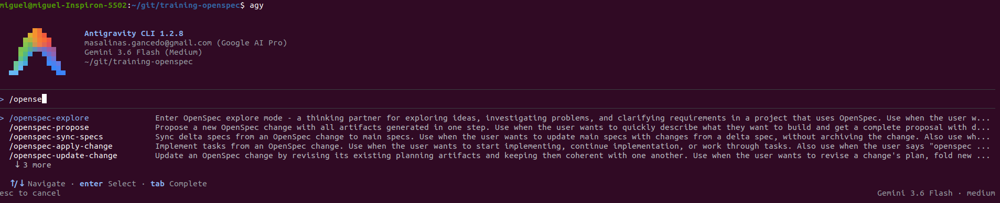
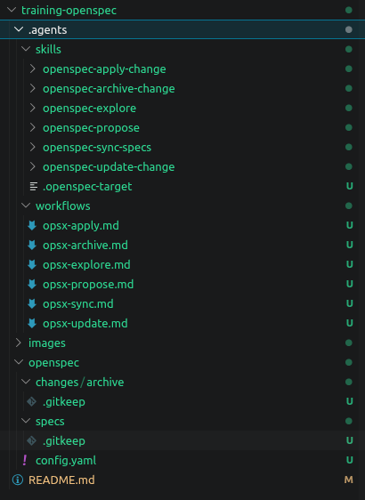

# training-openspec
Training Openspec

## Steps

- **STEP01**: Locate shell prompt in the project folder
  ```shell
  cd path/to/your/project
  ```

- **STEP02**: Install or upgrade PpenSpec package\
If not exist (You must have installed some nodeJS 20.19++ version in your computer)
  ```shell
  npm install -g @fission-ai/openspec@latest
  ```

- **STEP03**: Initilize OpenSpec project. \
  This will create some resources inside your project used by openspec tool. The unique question to be response will be the agent to be used. In my case Antigravity CLI:
  ```shell
  openspec init


                          Welcome to OpenSpec
                          A lightweight spec-driven framework
                          
          ████            This setup will configure:
        ██    ██            • Agent Skills for AI tools
      ██  ████  ██          • Workflow commands, if supported
      ██  ████  ██        
      ██  ████  ██        Quick start after setup:
        ██    ██            /opsx:propose  Start a change
          ████              /opsx:apply    Implement tasks
                            (spelling varies by tool)
                          
                          Press Enter to select tools...

                          ✔ Select tools to set up (40 available) Antigravity

  ▌ OpenSpec structure created
  ✔ Setup complete for Antigravity

  OpenSpec Setup Complete

  Created: Antigravity
  6 skills and 6 commands in .agents/
  Config: openspec/config.yaml (schema: spec-driven)

  Getting started:
    Start your first change: /opsx-propose "your idea"

  Note: 6 more workflows are available (new, continue, ff, bulk-archive, verify, onboard).
  Add them with `openspec config profile`.

  Learn more: https://github.com/Fission-AI/OpenSpec
  Feedback:   https://github.com/Fission-AI/OpenSpec/issues

  Restart your IDE to refresh commands.


  Tip: Run 'openspec completion install' for shell completions

  ```

  If you want update OpenSpec execute:
  ```shell
  openspec update
  ```

  To uninstall OpenSpect execute:
  ```shell
  npm uninstall -g @fission-ai/openspec
  ```

- **STEP04**: Start your agent antigravity from your codebase folder:
  ```shell
  agy
  ```

  Inside your agent list the OpenSpec commands installed:
  

- **STEP04**: Check the OpenSpec resources created in our project\
These are the new folders and resources created by OpenSpect after init: new skills and commands installed in your agent CLI. Initially the specs and changes folder are empty, because we start from a empty project:
